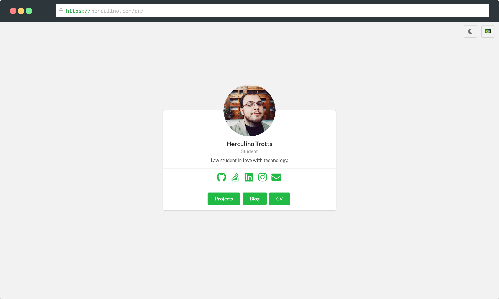
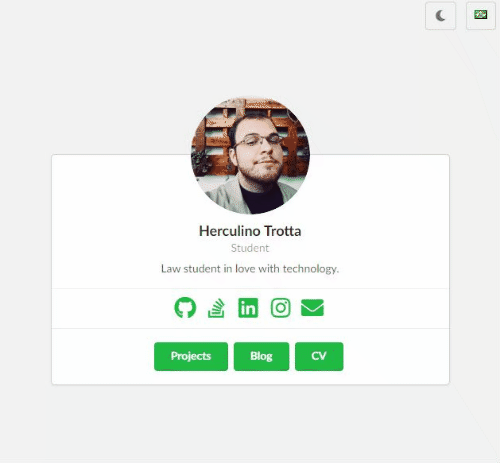
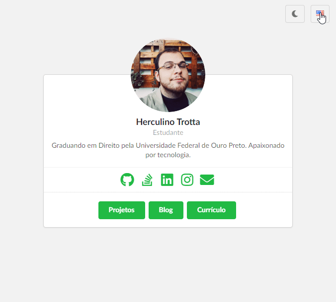
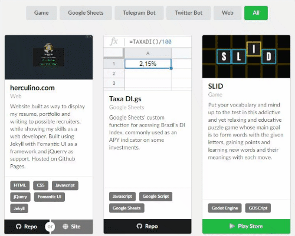

<div align="center">
    <a href="https://herculino.com" target="_blank">
    	
    </a>
</div>

<h3 align="center">herculino.com</h3>
<p align="center">My personal portfolio, CV and blog.</p>

<div align="center">
  <a href="https://github.com/eitchtee/eitchtee.github.io/blob/master/LICENSE" target="_blank"></a>
  <a href="https://herculino.com/" target="_blank"></a>
</div>

<br/>

---

<p align="center">
    <a href="#features">⭐ Features</a> •
    <a href="#tech-stack">🛠️ Tech Stack</a> • 
    <a href="#development">✏️ Development</a>
</p>

## Features

- Persistent **Dark-theme toggle** with user configuration detection



- Full localization with redirect on root domain
  - Two languages avaliable: English and Portuguese



- Filtering for projects and blog posts



## Tech Stack

The following tools were used in the construction of the project:

##### **Website**

-   **[Jekyll](https://jekyllrb.com/)**
-   **[Fomantic UI](https://fomantic-ui.com/)**
-   **[jQUery](https://jquery.com/)**

##### **Hosting**

-   **[Github Pages](https://pages.github.com/)**

##### **Tools**

-   _Editor_:  **[Visual Studio Code](https://code.visualstudio.com/)**

> Original template by **[Techfolios](http://techfolios.github.io/)**


## Development

1. [Install Jekyll](https://jekyllrb.com/docs/installation/)
1. [Install jekyll-sitemap](https://github.com/jekyll/jekyll-sitemap)
1. Clone this repo
1. ```$ cd "folder-you-cloned-into"```
1. ```$ jekyll serve``` for live-development server or ```$ jekyll build``` for building the website
